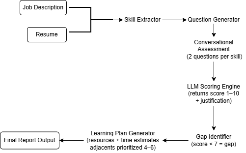

# 🎯 AI Skill Assessment & Personalised Learning Plan Agent

A conversational AI agent that takes a Job Description and a candidate's resume, assesses real proficiency on each required skill through targeted questions, identifies skill gaps, and generates a personalised learning plan with curated resources and time estimates.

---

## 🎥 Demo Video
> [https://drive.google.com/file/d/1aM51e7fqFR-FAFSHxSbg1Xyf8paC64_Q/view?usp=sharing]

---

## 💡 What It Does

A resume tells you what someone *claims* to know — not how well they actually know it.

This agent:
1. **Extracts** the top 3 required skills from any Job Description
2. **Conversationally assesses** the candidate with 2 targeted questions per skill (conceptual → applied)
3. **Scores** each skill from 1–10 with a proficiency level and feedback
4. **Identifies gaps** — any skill scored below 7 is flagged
5. **Generates a personalised learning plan** with free resources, time estimates, and hands-on projects

---

## 🛠️ Tech Stack

- **Frontend:** Streamlit
- **LLM:** Google Gemini (gemini-3-flash-preview)
- **PDF Parsing:** PyPDF2
- **Language:** Python 3.14.3

---

## ⚙️ Local Setup

### 1. Clone the repo
```bash
git clone https://github.com/gyash07/skill-assessment-agent.git
cd skill-assessment-agent
```

### 2. Create a virtual environment
```bash
python -m venv venv
venv\Scripts\activate  # Windows
```

### 3. Install dependencies
```bash
pip install -r requirements.txt
```

### 4. Add your API key
Create a `.env` file in the root folder:

GEMINI_API_KEY=your_gemini_api_key_here.

Get your free API key at: https://aistudio.google.com/app/apikey

### 5. Run the app
```bash
streamlit run app.py
```

---
## 🏗️ Architecture Diagram



## 📊 Scoring Logic

Each skill is assessed through **2 questions of increasing depth:**
- **Question 1** — Conceptual: "What is X and when would you use it?"
- **Question 2** — Applied: "Walk me through a real scenario where you used X"

**Proficiency Scale:**
| Score | Level | Meaning |
|-------|-------|---------|
| 1–3 | Beginner | Little to no knowledge |
| 4–5 | Elementary | Basic awareness only |
| 6–7 | Intermediate | Can work with guidance |
| 8–9 | Advanced | Works independently |
| 10 | Expert | Can teach others |

**Gap Threshold:** Any skill scored **below 7** is identified as a gap and included in the learning plan.

**Adjacent Skills:** Skills scored between 4–6 are prioritised first in the learning plan — these are closest to job-ready and require the least effort to level up.

---

## 📁 Sample Inputs & Outputs

- Sample Job Description: [`job_description.txt`](./job_description.txt)
- Sample Output: [`sample_input_output.md`](./sample_input_output.md)
---

## 🗂️ Project Structure
```
ai_skill_assessment_agent/
├── app.py               # Main Streamlit application
├── requirements.txt     # Python dependencies
├── job_description.txt  # Sample job description
├── .env.example         # API key template
├── .gitignore           # Files excluded from git
└── README.md            # This file
```
---

## 🔮 Future Improvements

- Support for more than 3 skills
- Export learning plan as PDF
- Deploy on Streamlit Cloud
- Add voice-based assessment
- Store results in a database

---
## ⚠️ API Usage & Limitations Note

This project uses the **Google Gemini API (Free Tier)** therefore due to usage limitations, I made certain tradeoffs in skills extraction and questionings which can be later changed for the more detailed evaluations, also using better model will give better results!

### Design Decisions Based on These Limits

To stay within free tier limits without requiring any billing setup, the following intentional trade-offs were made:

| Feature | Ideal Version | This Version (Free Tier) |
|---|---|---|
| Skills extracted from JD | 5 skills | 3 skills |
| Questions per skill | 3 questions | 2 questions |

> 💡 The core agent logic, scoring rubric, and learning plan generation remain fully functional — only the scale is reduced to respect free tier limits.

---

## 👤 Author
Built by Yash Goel — https://github.com/gyash07
